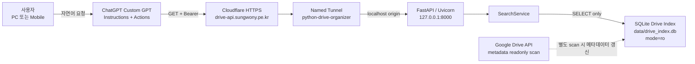

# Python Drive Organizer — Project 1-2 최종 완료 보고서

## 1. 최종 완료 상태

- 프로젝트: Python Drive Organizer
- 단계: **Project 1-2**
- 상태: **COMPLETED**
- 완료일: 2026-08-14
- Public API: `https://drive-api.sungwony.pe.kr`
- 데이터 원본: `data/drive_index.db`
- API 성격: Google Drive 메타데이터 인덱스의 read-only 조회

완료된 MVP:

| MVP | 내용 | 상태 |
|---|---|---|
| MVP-01 | Local Read-Only API | ✅ 완료 |
| MVP-02 | API Authentication / Security | ✅ 완료 |
| MVP-03 | Cloudflare Tunnel HTTPS + Windows 자동 시작 | ✅ 완료 |
| MVP-04 | GPTs Actions | ✅ 완료 |
| MVP-05 | PC/Mobile 자연어 종단 테스트 | ✅ 완료 |

MVP-01~04의 구현·검증 결과는 저장소의 각 단계 보고서와 산출물을 기준으로 작성했다. MVP-05의 PC·모바일 종단 테스트 완료 상태는 최종 사용자 확인을 기준으로 기록했다.

## 2. Project 1-2 목적

Project 1-2의 목적은 Python Drive Organizer가 구축한 SQLite Drive Index를 사용자가 PC와 모바일의 ChatGPT에서 자연어로 안전하게 조회할 수 있도록 만드는 것이었다.

핵심 목표:

- 기존 SQLite 파일·폴더 메타데이터를 FastAPI로 제공
- 외부에서 HTTPS로 접근 가능하게 구성
- Bearer API key로 데이터 endpoint 보호
- Windows 로그인 후 API 자동 시작
- Custom GPT가 자연어를 정해진 read-only Action으로 변환
- PC와 모바일에서 동일한 자연어 조회 흐름 확인
- Google Drive 쓰기 기능 없이 기존 데이터와 보안 경계 유지

## 3. 최종 아키텍처



중요한 실행 경계:

- GPT Action 요청은 Google Drive API를 직접 호출하지 않는다.
- FastAPI는 SQLite를 read-only mode로 조회한다.
- Google Drive 메타데이터 갱신은 별도의 scan 흐름이다.
- FastAPI origin은 외부 인터페이스가 아닌 `127.0.0.1:8000`에만 bind한다.
- 외부 ingress는 Cloudflare Tunnel만 담당한다.

## 4. MVP별 완료 내용

### MVP-01 — Local Read-Only API

- FastAPI 기반 localhost JSON API 구현
- 기존 `SearchService`와 SQLite Drive Index 재사용
- 파일, 폴더, Tree, Revision, Copy, DELETE 분류, Group, 최근 파일 조회 제공
- SQLite `mode=ro` 연결 사용
- API 요청 중 Google Drive 인증 또는 Drive API 호출 없음
- 오류를 JSON 404/422/503 형태로 처리
- Swagger UI와 OpenAPI JSON 제공

### MVP-02 — API Authentication / Security

- `/health`를 제외한 데이터 endpoint에 HTTP Bearer 인증 적용
- 환경변수 이름: `PDO_API_KEY`
- 프로젝트 루트 `.env` 선택적 로드
- 최소 길이 검증 및 startup fail-closed 적용
- `hmac.compare_digest()`를 통한 constant-time 비교
- 인증 누락·오류 시 HTTP 401 및 `WWW-Authenticate: Bearer`
- key 미설정 또는 잘못된 서버 구성 시 보호 endpoint가 열리지 않도록 구성
- API key가 응답, 오류, 문서 또는 로그에 노출되지 않도록 검증

### MVP-03 — Cloudflare Tunnel HTTPS + Windows 자동 시작

- 기존 Cloudflare Named Tunnel을 public hostname과 연결
- Windows `cloudflared` 서비스를 `Running / Automatic` 상태로 확인
- FastAPI/Uvicorn Windows 예약 작업 등록
- 현재 사용자 로그인 20초 후 API 자동 실행
- 가상환경 Python executable 직접 사용
- working directory 고정
- 중복 실행 정책 `IgnoreNew`
- Windows 재부팅 후 수동 PowerShell·가상환경 활성화·Uvicorn 입력 없이 자동 시작 확인
- 재부팅 후 localhost 및 외부 HTTPS 종단 검증 통과

### MVP-04 — GPTs Actions

- GPT Builder용 `gpt_action_openapi.yaml` 작성
- OpenAPI 3.1, HTTPS server, HTTP Bearer security 정의
- 고유 operationId 10개 구성
- GET-only 유지
- 실제 FastAPI endpoint·parameter·response 계약과 대조
- GPT Builder 호환성을 위해 operation parameter를 모두 inline 정의
- `components.parameters` 및 parameter `$ref` 제거
- `components.schemas`와 `components.responses` 참조 유지
- GPT Instructions 초안 작성
- 자연어 Action 테스트 시나리오 작성
- schema에 API key를 포함하지 않음

### MVP-05 — PC/Mobile 자연어 종단 테스트

- PC ChatGPT에서 자연어 요청 → GPT Action → HTTPS API → SQLite 조회 → 자연어 응답 흐름 확인
- Mobile ChatGPT에서 동일한 종단 흐름 확인
- PC와 모바일이 동일한 public API 및 Bearer 보호 endpoint를 사용
- 사용자가 PowerShell, Uvicorn 또는 cloudflared 명령을 직접 실행하지 않아도 조회 가능
- 자연어 요청이 read-only operation으로 연결되는 것을 확인
- 조회 결과를 파일·폴더 메타데이터로 응답하며 Drive 쓰기를 실행하지 않음

## 5. Public API 주소

```text
https://drive-api.sungwony.pe.kr
```

운영 확인 endpoint:

```text
GET /health
```

- `/health`: 인증 없이 사용 가능
- 데이터 endpoint: 정상 Bearer 인증 필수
- 외부 사용자는 Windows의 port 8000에 직접 접속하지 않고 Cloudflare HTTPS hostname을 사용

## 6. Cloudflare Tunnel 구조

| 항목 | 구성 |
|---|---|
| Domain | `sungwony.pe.kr` |
| Named Tunnel | `python-drive-organizer` |
| Public hostname | `drive-api.sungwony.pe.kr` |
| Public protocol | HTTPS |
| Origin | `http://127.0.0.1:8000` |
| Windows service | `cloudflared` |
| 서비스 시작 유형 | Automatic |

Cloudflare Tunnel이 외부 HTTPS 요청을 localhost FastAPI origin으로 전달한다. FastAPI는 `0.0.0.0`에 bind하지 않으며 공유기 port forwarding이나 Windows port 8000 직접 공개를 사용하지 않는다.

## 7. FastAPI 자동 시작 구조

Windows Task Scheduler 설정:

| 항목 | 값 |
|---|---|
| 작업 이름 | `Python Drive Organizer API` |
| Trigger | 현재 사용자 Windows 로그인 |
| 지연 | 20초 |
| Program | `C:\Users\HLB\Documents\Python-Drive-Organizer\.venv\Scripts\python.exe` |
| Arguments | `-m uvicorn api_server:app --host 127.0.0.1 --port 8000` |
| Start in | `C:\Users\HLB\Documents\Python-Drive-Organizer` |
| 중복 실행 | `IgnoreNew` |

가상환경 activation script 대신 가상환경의 Python 실행 파일을 직접 호출한다. 예약 작업에는 API key, OAuth token 또는 Cloudflare token을 넣지 않는다.

## 8. Bearer 인증 구조

보호 endpoint 요청 형식:

```http
Authorization: Bearer <configured-api-key>
```

인증 정책:

- 실제 API key는 `PDO_API_KEY` 환경변수 또는 Git에서 제외된 `.env`로 주입
- key 값은 Python 코드에 하드코딩하지 않음
- `/health`는 공개
- `/status`와 모든 데이터 endpoint는 Bearer 필수
- 인증 없음 또는 잘못된 인증: HTTP 401
- 정상 Bearer: HTTP 200
- GPT Builder Authentication에서 key를 별도로 설정
- OpenAPI schema에는 key 값이 없음

## 9. GPT Action operation 목록

| operationId | Method | Endpoint | 용도 |
|---|---|---|---|
| `getDriveStatus` | GET | `/status` | 인덱스 개수와 마지막 scan 상태 |
| `searchFiles` | GET | `/files/search` | 파일명·정규화명·기본명 부분 검색 |
| `searchFolders` | GET | `/folders/search` | 폴더명 부분 검색 |
| `listFolderChildren` | GET | `/folders/{folder_id}/children` | 직접 자식 또는 전체 하위 항목 |
| `getFolderTree` | GET | `/folders/tree` | 전체 또는 특정 폴더 Tree |
| `listRevisions` | GET | `/revisions` | Parser의 Revision 분류 조회 |
| `listCopies` | GET | `/copies` | Parser의 Copy 분류 조회 |
| `listAutoDeleteFiles` | GET | `/auto-delete` | `auto_action=DELETE` 분류 조회 |
| `listFileGroups` | GET | `/groups` | Grouping 결과와 멤버 조회 |
| `listRecentFiles` | GET | `/recent` | 최근 수정 시각 순 파일 조회 |

모든 operationId는 고유하며 POST, PUT, PATCH 또는 DELETE operation은 없다.

## 10. GPT Instructions 핵심 원칙

- Drive의 현재 상태를 기억이나 추측으로 답하지 않고 가능한 경우 Action 결과를 사용
- Python Drive Organizer SQLite/API를 source of truth로 사용
- API가 반환하지 않은 파일명, ID, 경로 또는 개수를 생성하지 않음
- 결과가 0건이면 그대로 0건으로 보고
- `total`과 `showing`이 다르면 일부만 표시됐음을 명확히 안내
- “전부” 요청 시 허용 범위 안에서 `limit` 조정 고려
- `folder_id`, `file_id`, `group_id`는 사용자 입력 또는 Action 결과의 실제 값만 사용
- `auto_action=DELETE`는 분류값이며 실제 삭제가 아님
- Revision, Copy, Group은 Python Parser/Grouping의 저장 결과를 그대로 사용
- 파일 내용이나 문서 본문을 읽을 수 있다고 표현하지 않음
- Folder Tree가 SQLite folder metadata 기반임을 유지
- Drive create/update/delete/move/copy 기능이 없음을 명확히 안내
- API key나 token을 대화에 출력하거나 사용자에게 채팅으로 요구하지 않음

## 11. 자연어 종단 테스트 결과

최종 종단 경로:

```text
자연어 요청
→ GPT Instructions에 따른 operation 선택
→ Bearer 인증된 HTTPS GET Action
→ Cloudflare Tunnel
→ localhost FastAPI
→ SQLite read-only 조회
→ JSON 결과
→ 자연어 응답
```

검증한 자연어 사용 범위:

- 인덱스 상태 조회
- 파일명 부분 검색
- 폴더명 부분 검색
- 선택된 폴더의 하위 항목 조회
- 전체 또는 특정 폴더 Tree 조회
- Revision/Copy 분류 조회
- DELETE 분류 조회
- 최근 변경 파일 조회
- 동일 계열 파일 그룹 조회
- 결과 0건 처리
- 일부 결과만 반환된 경우 `total/showing` 안내
- 금지된 쓰기 요청에 대한 기능 경계 유지

최종 결과: **PC와 모바일에서 자연어 기반 read-only 조회 흐름이 완료 상태로 확인됨.**

## 12. PC 테스트 결과

| 확인 항목 | 결과 |
|---|---|
| PC ChatGPT 자연어 요청 | ✅ 성공 |
| GPT Action 선택 및 호출 | ✅ 성공 |
| Cloudflare HTTPS 연결 | ✅ 성공 |
| Bearer 보호 endpoint 접근 | ✅ 성공 |
| SQLite metadata 결과 응답 | ✅ 성공 |
| 수동 PowerShell/Uvicorn 실행 필요 | 없음 |
| Drive 쓰기 실행 | 없음 |

PC에서 사용자는 로컬 서버 명령을 직접 실행하지 않고 ChatGPT 자연어 요청만으로 Drive Index를 조회할 수 있다.

## 13. 모바일 테스트 결과

| 확인 항목 | 결과 |
|---|---|
| Mobile ChatGPT 자연어 요청 | ✅ 성공 |
| GPT Action 선택 및 호출 | ✅ 성공 |
| 외부 HTTPS 접근 | ✅ 성공 |
| Bearer 보호 endpoint 접근 | ✅ 성공 |
| SQLite metadata 결과 응답 | ✅ 성공 |
| PC와 동일한 operation 사용 | ✅ 확인 |
| Drive 쓰기 실행 | 없음 |

모바일은 로컬 네트워크의 port 8000에 직접 접근하지 않고 Cloudflare public hostname을 통해 동일한 read-only API를 사용한다.

## 14. SQLite read-only 원칙

- FastAPI DB 연결은 SQLite URI의 read-only mode 사용
- API와 GPT Action은 SELECT 기반 조회만 수행
- API 요청에서 scan, parser backfill 또는 grouping rebuild를 실행하지 않음
- Google Drive API를 호출하지 않음
- API 검증 과정에서 요청 전후 DB 해시가 동일함을 확인
- 마지막 검증 DB SHA-256:

```text
857dfc31d511fb3a9de16e9f84beaec60dda776ee42c0ae594c1623feac0cc21
```

해시는 데이터 동일성 확인값이며 인증 secret이 아니다.

## 15. Google Drive write 없음

Project 1-2에는 다음 기능이 없다.

- 파일·폴더 생성
- 이름 변경
- 내용 수정
- 이동
- 복사 실행
- 휴지통 이동
- 삭제
- 권한 또는 공유 설정 변경

`listAutoDeleteFiles`는 `auto_action=DELETE`로 분류된 메타데이터를 조회할 뿐 실제 Drive action을 실행하지 않는다. 해당 응답은 다음 안전 상태를 유지한다.

```text
classification_only = true
drive_action_executed = false
```

## 16. OAuth scope

Google Drive metadata scan에 사용하는 OAuth scope:

```text
https://www.googleapis.com/auth/drive.metadata.readonly
```

Drive 쓰기 scope는 추가하지 않았다. GPT Action의 API 조회는 이 OAuth 인증을 직접 사용하지 않고 Bearer로 보호된 SQLite read-only API를 사용한다.

## 17. Secret 비포함 확인

다음 실제 값은 이 보고서와 GPT Action schema, Instructions 및 테스트 문서에 기록하지 않았다.

- `PDO_API_KEY` 실제 값
- Google OAuth access/refresh token
- `token.json` 내용
- `credentials.json` 내용
- Cloudflare Tunnel token

Secret 관리 경계:

- `.env`, `credentials.json`, `token.json`, `data/`, `logs/`는 Git 제외 대상
- GPT Builder에는 Authentication 설정을 통해 API key를 별도 등록
- 예약 작업 action과 OpenAPI schema에는 secret 값 없음
- API 응답에 key 또는 token 값 없음

## 18. 현재 제한사항

### 마지막 SQLite scan 기준

조회 결과는 Google Drive의 실시간 상태가 아니라 마지막으로 성공한 SQLite scan의 메타데이터 스냅샷이다. scan 이후 Drive에서 발생한 변경은 다음 scan이 완료되기 전까지 반영되지 않는다.

### 파일 내용 읽기 없음

파일명, 경로, ID, 수정 시각, Parser/Grouping 결과 등 메타데이터만 조회한다. Google Docs, PDF, Office 문서 또는 기타 파일의 본문을 읽거나 검색하지 않는다.

### 쓰기 기능 없음

Drive create/update/delete/move/copy/trash를 수행할 수 없다. 자연어로 요청해도 이를 실행할 Action이 없다.

### 대용량 응답 제한

- `limit` 허용 범위: 1~1000
- 기본값: 일반 목록 100, 최근 파일 20
- API에 offset 또는 page token이 없음
- `total`이 `showing`보다 크면 일부 결과만 반환된 것
- 1000건을 초과하는 전체 결과를 한 번의 Action으로 모두 가져올 수 없음
- 대형 Folder Tree의 `tree_text`는 ChatGPT 응답 길이 또는 Action 처리 한도의 영향을 받을 수 있음

### 로컬 운영 의존성

- Windows PC가 켜져 있고 사용자가 로그인해야 예약 작업이 실행됨
- FastAPI origin 또는 cloudflared 서비스가 중지되면 외부 API를 사용할 수 없음
- 로컬 SQLite DB가 없거나 손상되면 데이터 endpoint가 HTTP 503을 반환할 수 있음

## 19. 향후 확장 경계

Project 1-2의 완료 범위는 자연어 read-only 조회까지다. 다음 기능은 별도 설계, 위험 검토, 사용자 승인 및 새로운 MVP로 분리해야 한다.

- SQLite scan 자동 주기화 및 최신성 상태 표시 강화
- offset/cursor 기반 pagination
- 응답 크기 제어와 Tree 분할 조회
- API 가용성 모니터링 및 운영 로그 개선
- 다중 사용자 인증·key 회전·세분화된 권한
- 파일 내용 인덱싱 또는 검색
- Google Drive 쓰기 기능
- 삭제 후보 승인 workflow
- Drive rename/move/copy/trash 실행

특히 Drive 쓰기 기능은 현재 read-only API에 단순 추가하지 않는다. 별도의 write scope, 사용자 확인, 감사 로그, dry-run, 복구 전략 및 권한 분리가 마련된 후 독립 단계로 검토해야 한다.

## 20. 최종 결론

Python Drive Organizer Project 1-2는 다음 목표를 달성했다.

- SQLite Drive Index의 local read-only API 제공
- Bearer 인증으로 데이터 endpoint 보호
- Cloudflare Tunnel을 통한 HTTPS 공개
- Windows 로그인 후 FastAPI 자동 시작
- GPT Actions용 GET-only schema와 안전 Instructions 구성
- PC와 모바일에서 자연어 종단 조회 완료
- SQLite read-only와 Google Drive metadata-only 원칙 유지
- API key, OAuth token 및 Cloudflare token 비노출

따라서 Project 1-2는 **자연어 기반 Google Drive 메타데이터 조회 시스템**으로 최종 완료되었다.
