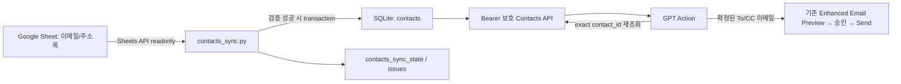

# Project 1-6 — Contact Directory MVP-01 설계보고

- 프로젝트: Python Drive Organizer
- 단계: Project 1-6 — Contact Directory / MVP-01 설계
- 작성일: 2026-08-17
- 상태: 설계 완료, 구현 전

## 1. 목적

Google Drive의 `이메일/주소록` Google Spreadsheet를 주소록 source of truth로 사용한다. Python은 Sheet를 읽기 전용으로 조회해 SQLite에 current-state 주소록을 만들고, GPT는 이름·소속·직급·이메일로 연락처를 검색한 뒤 정확한 이메일 주소를 기존 Enhanced Email Preview에 전달한다.

이번 MVP는 설계만 수행한다. Google Sheet, OAuth, SQLite schema, FastAPI, GPT Action schema와 실제 이메일 발송 동작은 변경하지 않는다.

## 2. 핵심 설계 결정

| 항목 | 권장안 | 이유 |
|---|---|---|
| 운영 대상 | 고정된 `spreadsheet_id`와 탭 이름 `주소록` | 동명 파일 오선택 방지 |
| 최초 대상 확정 | Drive 인덱스 또는 사용자가 연 Sheet URL로 ID 확인 후 설정에 고정 | Sheets scope에 Drive 검색 권한을 섞지 않음 |
| 탭 선택 | 첫 번째 탭이 아니라 명시적 `주소록` 탭 | 탭 순서 변경으로 다른 데이터를 읽는 사고 방지 |
| 연락처 identity | SQLite가 발급한 opaque `contact_id`; 고유한 정규화 이메일로 기존 행 재결합 | 이름·행 번호를 identity로 쓰지 않고 행 이동에도 ID 유지 |
| `source_row` | 진단용 위치 정보 | 정렬·삽입으로 바뀌므로 identity로 사용하지 않음 |
| 삭제 정책 | 완전한 Sheet 읽기와 검증 성공 후 hard delete | 삭제된 주소가 검색·발송 후보로 남는 위험 방지 |
| 중복 이메일 | conflict로 기록하고 발송 불가 | 같은 이메일의 사람을 임의 선택하지 않음 |
| 검색 API | 개인정보가 URL 로그에 남지 않는 `POST /contacts/search` | GET query string보다 개인정보 노출을 줄임 |
| Daily Refresh | Drive pipeline과 독립 실행·독립 상태 기록 | 서로 다른 source의 장애를 격리 |
| 수동 갱신 | CLI 우선, 이후 보호된 POST Action 추가 | 초기 운영·오류 확인이 단순함 |

## 3. 최종 아키텍처



Google Sheet는 수정하지 않는다. 동기화가 변경하는 대상은 로컬 SQLite의 주소록 테이블뿐이다.

## 4. Sheet 위치와 ID 고정 전략

기본 운영 위치는 다음과 같다.

- Drive 폴더 이름: `이메일`
- Spreadsheet 이름: `주소록`
- Spreadsheet 내부 탭 이름: `주소록`

폴더와 파일 이름은 최초 설정 시 대상을 찾는 힌트일 뿐, 매 동기화 실행의 identity로 사용하지 않는다. 최초 설정 때 정확한 파일을 확인한 뒤 다음 값을 설정에 고정한다.

- `PDO_CONTACTS_SPREADSHEET_ID`
- `PDO_CONTACTS_SHEET_NAME=주소록`

설정 저장 위치는 기존 운영 방식과 맞춘 프로젝트 루트 `.env`를 권장한다. Spreadsheet ID는 OAuth token은 아니지만 외부 문서와 공개 로그에는 노출하지 않는다.

`folder_id`는 최초 후보 확인용으로 선택 저장할 수 있지만, 런타임 Sheets 조회에는 `spreadsheet_id`와 탭 이름만 사용한다. 파일이 다른 폴더로 이동해도 Spreadsheet ID는 유지되므로 불필요한 장애를 줄일 수 있다.

### 최초 확정 절차

1. 현재 Drive SQLite 인덱스에서 정확한 `이메일` 폴더 후보를 확인한다.
2. 동명 폴더가 둘 이상이면 경로와 `folder_id`를 사용자에게 보여주고 선택받는다.
3. 선택된 폴더의 직접 자식 중 MIME type이 Google Spreadsheet이고 이름이 정확히 `주소록`인 파일을 확인한다.
4. 동명 Spreadsheet가 둘 이상이면 ID와 경로를 보여주고 선택받는다.
5. 확정된 Spreadsheet ID를 설정에 고정한다.
6. MVP-02의 Sheets OAuth 이후 Spreadsheet metadata와 `주소록` 탭을 검증한다.

Drive 인덱스가 최신이 아니거나 후보를 확정할 수 없으면 사용자가 브라우저에서 정확한 Sheet를 열고 URL의 Spreadsheet ID를 제공하는 수동 설정을 사용한다. 임의 첫 번째 후보 선택은 금지한다.

## 5. 탭 및 컬럼 schema

첫 번째 탭은 사용하지 않는다. 탭 순서는 사용자가 쉽게 바꿀 수 있으므로 명시적 탭 이름 `주소록`을 사용한다. Sheets metadata에서 탭 이름과 숫자 `sheetId`를 확인하고, 동기화 기록에는 둘 다 남긴다.

첫 행의 기본 헤더는 다음 5개다.

| 순서 | Sheet 헤더 | 내부 필드 | 필수 | 비고 |
|---:|---|---|---|---|
| 1 | 소속 | `organization` | 아니요 | 표시·검색용 |
| 2 | 성명 | `name` | 예 | 빈 값이면 invalid |
| 3 | 직급 | `title` | 아니요 | 표시·검색용 |
| 4 | 이메일 | `email` | 발송 시 예 | 빈 값 또는 invalid면 조회만 가능 |
| 5 | 전화번호 | `phone` | 아니요 | 조회 전용 문자열 |

MVP-02에서는 첫 행을 trim한 뒤 위 5개 헤더와 순서까지 정확히 일치하도록 검증한다. 누락, 중복, 순서 변경 또는 예상하지 않은 추가 열이 있으면 전체 동기화를 실패시키고 기존 contacts를 보존한다. 이후 필요성이 확인되면 헤더 이름 기반 순서 독립 매핑을 별도 MVP에서 검토한다.

조회 range 후보는 `'주소록'!A:E`다. 전화번호는 Sheets API의 표시 문자열로 읽고 SQLite `TEXT`로 저장한다. 다만 사용자가 Sheet에 숫자 형식으로 입력해 이미 앞자리 0을 잃은 경우 Python이 복원할 수 없으므로 전화번호 열은 Google Sheet에서 일반 텍스트 형식을 권장한다.

## 6. 정규화 및 유효성 규칙

원문 표시값과 검색·비교용 정규화값을 분리한다.

- 모든 값: 문자열 변환 후 앞뒤 공백 제거
- 빈 행: 5개 필드가 모두 비어 있으면 무시
- 이름: Unicode NFKC, 연속 공백 축약, casefold한 `normalized_name` 생성
- 소속·직급: 같은 방식으로 검색용 정규화값 생성
- 이메일: 앞뒤 공백 제거 후 case-insensitive 비교용 `normalized_email` 생성
- 전화번호: 숫자 변환 금지, 원문 문자열 유지
- 이름이 비어 있는 행: invalid
- 이메일이 비어 있거나 형식이 잘못된 행: 연락처 조회는 허용하지만 `email_usable=false`
- CR/LF가 포함된 이메일, 여러 주소가 한 셀에 입력된 값, 표시 이름이 섞인 주소: invalid

이메일 형식 검증은 프로젝트의 기존 이메일 수신자 검증 규칙과 동일한 공통 함수를 재사용하는 방향을 권장한다. Sheet sync와 실제 Send의 유효성 판정이 달라지는 것을 방지한다.

## 7. 연락처 identity

이름은 동명이인 때문에 identity가 될 수 없다. `spreadsheet_id + source_row`도 정렬, 행 삽입과 이동에 따라 다른 사람을 같은 ID로 오인할 수 있으므로 primary identity로 사용하지 않는다.

### 권장 방식

`contact_id`는 SQLite가 최초 발견 시 발급하는 추측 불가능한 opaque ID로 한다.

예시 형식:

```text
CONTACT-<UUID>
```

다음 동기화에서 기존 행과 새 Sheet 행을 재결합하는 기준은 아래 순서다.

1. Sheet 전체에서 유일하고 유효한 `normalized_email`이 기존 contacts에도 유일하면 기존 `contact_id` 유지
2. 이메일이 없거나 invalid인 행은 정규화된 전체 내용 fingerprint가 기존 행과 유일하게 일치할 때만 기존 ID 유지
3. 안전하게 일치시킬 수 없으면 새 `contact_id` 발급
4. 기존에 남았지만 이번 완전한 snapshot에서 일치하지 않은 ID는 삭제

이 방식은 이름·소속·직급·전화번호 수정과 행 이동에는 ID를 유지하고, 이메일 자체가 바뀌거나 매칭이 모호하면 기존 ID를 다른 사람에게 잘못 재사용하지 않는다. 이메일 변경은 안전을 위해 기존 연락처 삭제 + 새 연락처 추가로 취급할 수 있다.

`source_row`는 현재 Sheet 위치와 오류 안내용일 뿐이다. GPT가 source row를 연락처 선택 기준으로 사용하지 않는다.

## 8. SQLite schema 제안

저장 위치는 기존 `data/drive_index.db` 안의 별도 테이블을 권장한다. 기존 프로젝트 구조를 늘리지 않고 API가 한 SQLite 연결 정책을 유지할 수 있다. 다음 SQL은 설계안이며 MVP-01에서는 실행하지 않는다.

### `contacts`

```sql
CREATE TABLE contacts (
    contact_id TEXT PRIMARY KEY,
    organization TEXT,
    name TEXT NOT NULL,
    title TEXT,
    email TEXT,
    phone TEXT,
    normalized_organization TEXT,
    normalized_name TEXT NOT NULL,
    normalized_title TEXT,
    normalized_email TEXT,
    email_usable INTEGER NOT NULL DEFAULT 0,
    conflict_code TEXT,
    source_spreadsheet_id TEXT NOT NULL,
    source_sheet_id INTEGER NOT NULL,
    source_sheet_name TEXT NOT NULL,
    source_row INTEGER NOT NULL,
    source_fingerprint TEXT NOT NULL,
    last_seen_sync_id TEXT NOT NULL,
    synced_at TEXT NOT NULL,
    created_at TEXT NOT NULL,
    updated_at TEXT NOT NULL,
    UNIQUE (source_spreadsheet_id, source_sheet_id, source_row)
);

CREATE INDEX idx_contacts_normalized_name
    ON contacts(normalized_name);
CREATE INDEX idx_contacts_normalized_email
    ON contacts(normalized_email);
CREATE INDEX idx_contacts_organization
    ON contacts(normalized_organization);
CREATE INDEX idx_contacts_title
    ON contacts(normalized_title);
CREATE INDEX idx_contacts_last_seen_sync
    ON contacts(last_seen_sync_id);
```

중복 이메일 행도 conflict 상태로 보존해야 하므로 `normalized_email` 전체에 UNIQUE constraint를 두지 않는다. 애플리케이션이 현재 snapshot의 이메일 중복을 먼저 계산하고, 유일하고 유효한 이메일에만 `email_usable=1`을 부여한다.

### `contacts_sync_state`

```sql
CREATE TABLE contacts_sync_state (
    sync_id TEXT PRIMARY KEY,
    status TEXT NOT NULL,
    started_at TEXT NOT NULL,
    finished_at TEXT,
    source_spreadsheet_id TEXT,
    source_sheet_id INTEGER,
    source_sheet_name TEXT,
    rows_seen INTEGER NOT NULL DEFAULT 0,
    valid_rows INTEGER NOT NULL DEFAULT 0,
    inserted INTEGER NOT NULL DEFAULT 0,
    updated INTEGER NOT NULL DEFAULT 0,
    deleted INTEGER NOT NULL DEFAULT 0,
    unchanged INTEGER NOT NULL DEFAULT 0,
    invalid INTEGER NOT NULL DEFAULT 0,
    conflicts INTEGER NOT NULL DEFAULT 0,
    message TEXT,
    created_at TEXT NOT NULL
);

CREATE INDEX idx_contacts_sync_started
    ON contacts_sync_state(started_at);
```

권장 status:

- `RUNNING`
- `COMPLETED`
- `COMPLETED_WITH_WARNINGS`
- `FAILED`

### `contacts_sync_issues`

행별 invalid/conflict를 운영 로그에 개인정보 원문으로 남기지 않기 위해 선택적으로 다음 로컬 테이블을 권장한다.

```sql
CREATE TABLE contacts_sync_issues (
    sync_id TEXT NOT NULL,
    source_row INTEGER NOT NULL,
    contact_id TEXT,
    issue_code TEXT NOT NULL,
    severity TEXT NOT NULL,
    message TEXT,
    created_at TEXT NOT NULL,
    PRIMARY KEY (sync_id, source_row, issue_code)
);
```

`message`에는 이름, 이메일과 전화번호 원문을 넣지 않고 `Row 12 has DUPLICATE_EMAIL` 같은 안전한 설명만 저장한다.

## 9. 동기화 정책

sync ID 형식 후보:

```text
CONTACTS-YYYYMMDD-HHMMSS
```

권장 동기화 순서는 다음과 같다.

1. `contacts_sync_state`에 `RUNNING` 기록
2. 고정된 Spreadsheet ID와 `주소록` 탭 metadata 확인
3. 첫 행 헤더 검증
4. A:E 전체 행을 메모리 staging 구조로 읽기
5. trim, 정규화, 형식 검증, 중복 검출
6. 기존 contacts와 안전한 identity reconciliation 수행
7. 하나의 SQLite transaction에서 INSERT/UPDATE/DELETE 적용
8. transaction commit 후 sync 상태와 통계 완료 기록

Sheet 읽기, 페이지/범위 응답, 헤더 검증 또는 SQLite 반영 중 오류가 발생하면 contacts 변경 transaction을 rollback한다. 불완전한 결과로 기존 current-state를 삭제하지 않는다. 가능한 경우 sync 상태만 `FAILED`로 남긴다.

### 삭제 정책

current-state 주소록에는 hard delete가 적합하다. Sheet에서 삭제한 주소가 `active=false`로 남아 검색되거나 GPT가 과거 이메일을 사용하는 위험을 피할 수 있다.

단, 삭제는 다음 조건을 모두 만족할 때만 수행한다.

- 지정 Spreadsheet와 탭 전체 읽기 성공
- 헤더 검증 성공
- staging 검증 완료
- SQLite transaction 시작 가능

감사 이력이 필요해지면 active flag로 전환하지 않고 별도 history/audit table을 설계한다.

## 10. 중복 및 동명이인 정책

| 상황 | 허용 | 발송 가능 | 처리 |
|---|---|---|---|
| 같은 이메일이 여러 행 | 데이터는 보존 | 아니요 | 관련 행 모두 `DUPLICATE_EMAIL`, 사용자에게 Sheet 수정 요청 |
| 같은 이름+소속+직급, 이메일 다름 | 보존 | 자동 확정 금지 | 후보를 모두 표시하고 `contact_id` 선택 요청 |
| 동명이인, 소속/직급/이메일 다름 | 허용 | 선택 후 가능 | 정상 복수 검색 결과 |
| 이메일 빈 값 | 허용 | 아니요 | `EMAIL_MISSING`, 조회 결과에 표시 |
| 이메일 형식 오류 | 허용 | 아니요 | `EMAIL_INVALID`, 원문을 발송에 사용하지 않음 |
| 완전히 동일한 중복 행 | 보존 또는 issue staging | 아니요 | `DUPLICATE_ROW`; 임의 병합 금지 |

경고가 있는 동기화는 `COMPLETED_WITH_WARNINGS`로 완료할 수 있다. 다만 conflict 연락처에는 `email_usable=0`을 적용해 이메일 발송 후보가 되지 않도록 한다.

## 11. Google Sheets OAuth와 token 분리

권장 scope:

```text
https://www.googleapis.com/auth/spreadsheets.readonly
```

권장 token:

```text
contacts_sheet_token.json
```

MVP-02에서 별도 `contacts_sheet_client.py`가 `credentials.json`으로 최초 OAuth를 수행하고 전용 token만 재사용한다. 다음 기존 token과 scope는 변경하지 않는다.

| 용도 | Scope | Token |
|---|---|---|
| Drive metadata index | `drive.metadata.readonly` | `token.json` |
| Drive 파일 다운로드 | `drive.readonly` | `drive_download_token.json` |
| Gmail 발송 | `gmail.send` | `gmail_send_token.json` |
| Drive 링크 permission | `drive` | `drive_share_token.json` |
| Contacts Sheet 읽기 | `spreadsheets.readonly` | `contacts_sheet_token.json` |

`contacts_sheet_token.json`은 MVP-02에서 `.gitignore`에 추가한다. Sheets OAuth에 Drive scope를 합치지 않는다. 런타임 파일 검색도 하지 않고 고정된 Spreadsheet ID만 조회한다.

## 12. Contacts Search API

### GET과 POST 비교

`GET /contacts/search?q=홍길동`은 일반적인 REST 조회 형태지만 이름·소속·이메일이 Uvicorn, Tunnel 또는 proxy access log의 URL에 남을 수 있다. 주소록은 개인정보이므로 read-only POST body를 권장한다.

```http
POST /contacts/search
Authorization: Bearer <configured key>
Content-Type: application/json
```

요청 후보:

```json
{
  "q": "HLB 홍길동 부장",
  "organization": null,
  "name": null,
  "title": null,
  "email": null,
  "limit": 20
}
```

- `q`: 이름·소속·직급·이메일 통합 검색
- exact filter: `organization`, `name`, `title`, `email`
- `q`와 filter 조합은 AND
- `q` 또는 하나 이상의 filter 필수
- `limit`: 기본 20, 최소 1, 최대 100
- read-only Action이므로 향후 `x-openai-isConsequential=false`

응답 후보:

```json
{
  "total": 1,
  "showing": 1,
  "items": [
    {
      "contact_id": "CONTACT-opaque-id",
      "organization": "HLB Korea",
      "name": "홍길동",
      "title": "부장",
      "email": "hong@example.com",
      "phone": "010-0000-0000",
      "email_usable": true,
      "conflict_code": null
    }
  ]
}
```

검색 우선순위는 정규화 이메일 exact, 이름 exact, 이름 prefix, 각 필드 contains 순으로 하고 동일 점수는 이름·소속·직급·`contact_id`로 결정적으로 정렬한다.

검색 결과 정책:

- 0명: 없다고 보고
- 1명이며 `email_usable=true`: 선택 가능
- 1명이지만 이메일 사용 불가: 이유를 보여주고 발송 금지
- 2명 이상: 이름·소속·직급·마스킹하지 않은 실제 발송 이메일을 사용자에게 표시하고 선택 요청
- GPT가 첫 번째 후보를 임의 선택하지 않음

## 13. Exact Contact lookup 및 상태 API

### `GET /contacts/{contact_id}`

이메일 Preview 직전에 이전 검색 결과의 exact `contact_id`를 재조회한다. 현재 contacts에 없으면 HTTP 404를 반환하고 이름이나 과거 이메일로 대체하지 않는다.

응답에는 검색 결과와 같은 연락처 필드, `email_usable`, conflict 상태를 포함한다. `source_spreadsheet_id`, source row와 내부 fingerprint는 외부 응답에서 제외한다.

### `GET /contacts/status`

가장 최근 sync의 다음 값을 반환한다.

- `latest_sync_id`
- `latest_sync_status`
- `last_success_at`
- `rows_seen`
- `valid_rows`
- `inserted`, `updated`, `deleted`, `unchanged`
- `invalid`, `conflicts`

주소록이 한 번도 성공적으로 동기화되지 않았으면 명확히 `last_success_at=null`을 반환한다.

모든 Contacts endpoint는 기존 `PDO_API_KEY` Bearer 인증을 적용한다. `/health`처럼 공개하지 않는다.

## 14. 이메일 연동

이름 기반 이메일 요청 흐름은 다음과 같다.

1. `searchContacts`로 후보 검색
2. 0명/복수/invalid 정책 적용
3. 선택된 exact `contact_id`를 `getContact`로 재조회
4. 반환된 이메일을 기존 `previewEmailWithFiles`의 To/CC에 전달
5. GPT가 주소록 표시 정보와 실제 이메일을 Preview에 함께 표시
6. 기존 explicit approval과 exact `preview_id` 규칙으로 `sendEmailWithFiles` 호출

사용자가 이메일 주소를 직접 입력한 경우 주소록 검색을 강제하지 않는다. Preview에는 해당 주소를 `직접 입력`으로 구분한다.

표시 예:

```text
To (주소록):
홍길동 / HLB Korea / 부장
hong@example.com

CC (직접 입력):
external@example.com
```

MVP-02에서는 기존 Enhanced Email API request schema를 변경하지 않고, GPT가 exact lookup 결과의 이메일 문자열을 기존 To/CC 필드에 전달하는 최소 연동을 권장한다. Contact metadata까지 서버 Preview에 구조적으로 보존하는 기능은 후속 MVP 경계로 둔다.

## 15. Daily Refresh 통합

현재 08:00 Drive pipeline은 Drive sync → Parser → Grouping 순으로 앞 단계 실패 시 중단한다. Contacts Sheet는 독립된 source이므로 같은 실패 체인에 넣지 않는다.

권장 orchestration:

```text
08:00 Daily Refresh 시작
├─ Drive pipeline 실행 및 기존 scan_state 기록
└─ Contacts Sheet sync 실행 및 contacts_sync_state 기록
최종적으로 두 결과를 각각 보고
```

Drive가 실패해도 Contacts sync를 시도하고, Contacts가 실패해도 기존 Drive 결과를 되돌리지 않는다. 최종 프로세스 exit code는 하나라도 실패하면 non-zero로 할 수 있지만 각 source의 상태와 오류 메시지는 분리한다.

초기 안정성을 위해 MVP-02에서는 `contacts_sync.py`를 독립 실행으로 먼저 검증하고, 성공 후 `daily_refresh.py`에 독립 try/except 단계로 연결한다.

## 16. 수동 갱신

1차 권장 명령:

```powershell
python contacts_sync.py
```

후속 FastAPI 후보:

```http
POST /contacts/refresh
```

GPT operationId 후보는 `refreshContacts`다. 이 작업은 Google Sheet read와 SQLite current-state 변경을 수행하므로, GPT Action에 노출할 때는 `x-openai-isConsequential=true`를 권장한다. 사용자가 주소록 갱신을 명시적으로 요청하고 확인한 경우에만 실행한다.

동시 refresh는 SQLite lock 또는 애플리케이션 lock으로 한 번만 허용하고, 이미 실행 중이면 HTTP 409를 반환한다. 자동 재시도는 하지 않는다.

## 17. GPT Instructions 추가 원칙

MVP-02 이후 다음 원칙을 GPT Instructions에 반영한다.

1. 사람 이름으로 이메일 주소를 생성하거나 추측하지 않는다.
2. 사용자가 이름·소속·직급으로 수신자를 지정하면 Contacts Action 결과를 사용한다.
3. 검색 결과가 한 명이고 `email_usable=true`일 때만 자동 확정할 수 있다.
4. 동명이인 또는 복수 결과면 이름·소속·직급·실제 이메일을 보여주고 사용자가 `contact_id`에 해당하는 사람을 선택하게 한다.
5. 주소록에 없는 사람은 없다고 보고한다.
6. 이메일이 비어 있거나 invalid/conflict인 연락처는 발송 대상으로 사용하지 않는다.
7. 사용자가 직접 제공한 정상 이메일은 주소록 검색 없이 사용할 수 있다.
8. Preview에는 주소록 연락처와 직접 입력 주소를 명확히 구분한다.
9. 발송 직전에 exact `contact_id`를 다시 조회하며, stale ID를 이름이나 기억으로 대체하지 않는다.
10. 이메일이 없다는 이유로 전화번호를 사용해 전화·SMS·메신저 발송을 제안하거나 실행하지 않는다.

기존 Enhanced Email의 Preview → 사용자 승인 → exact `preview_id` → Send, LINK 공유 경고, CC/파일 수, idempotency 정책은 그대로 유지한다.

## 18. 개인정보 및 로그 정책

- Contacts API는 전 endpoint에 기존 Bearer 인증 적용
- 주소록 endpoint를 공개 health endpoint로 취급하지 않음
- API key, OAuth token과 Spreadsheet 원문을 source/report에 기록하지 않음
- `contacts_sheet_token.json`, `.env`, `data/`, `logs/`는 Git 제외
- sync 운영 로그에는 sync ID, 통계, source row, issue code만 기록
- 이메일·전화번호·이름·검색어 원문을 일반 로그에 기록하지 않음
- 필요 시 이메일은 기존 방식으로 마스킹
- GET query string의 개인정보 노출을 피하기 위해 search는 POST body 권장
- SQLite DB 자체가 개인정보 저장소이므로 파일 접근 권한과 백업 범위를 제한
- API 응답은 사용자 요청에 필요한 필드만 반환하고 source ID/fingerprint는 숨김

전화번호는 조회용 문자열일 뿐이며 전화, SMS 또는 다른 메시지 전송 기능을 추가하지 않는다.

## 19. 실패 및 안전 경계

- 설정된 Spreadsheet ID 없음: sync 시작 전 실패
- token 없음/무효: OAuth 필요 상태를 명확히 보고하되 자동 권한 확대 금지
- 탭 없음: 실패, 첫 번째 탭 fallback 금지
- 헤더 불일치: 실패, 기존 contacts 보존
- Sheets 응답 불완전: 실패, 삭제 처리 금지
- 중복 이메일: sync warning, 관련 연락처 발송 금지
- SQLite 오류: transaction rollback
- stale `contact_id`: 404, 재검색 요구
- 주소록 최신성이 오래됨: 상태와 마지막 성공 시각을 표시하고 필요하면 refresh 제안
- Sheet write, 행 수정, 형식 변경과 자동 정리: 금지

## 20. MVP-02 구현 범위

다음 MVP의 최소 구현 범위는 아래와 같다.

1. `contacts_sheet_client.py`
   - Sheets API v4
   - `spreadsheets.readonly`
   - 전용 `contacts_sheet_token.json`
2. `contacts_sync.py`
   - 고정 Spreadsheet ID와 `주소록` 탭 조회
   - 헤더·행 검증과 정규화
   - duplicate/conflict 판정
   - transactional INSERT/UPDATE/DELETE
3. `database.py`
   - `contacts`, `contacts_sync_state`, 필요 시 `contacts_sync_issues` schema 추가
4. 설정 및 Git 보호
   - `.env` 설정 이름 문서화
   - token ignore 추가
5. 테스트
   - exact header와 불일치 header
   - 공백·한글·case-insensitive 이메일
   - 전화번호 선행 0
   - 행 이동 후 identity 유지
   - 이메일 변경 시 안전한 새 identity
   - 중복 이메일·동명이인·빈 이메일
   - 완전한 snapshot에서만 삭제
   - 실패 rollback과 sync state
   - 다른 working directory에서 동일 절대 DB/token 경로
6. 초기 실제 Sheet read-only 검증
   - `이메일/주소록` 대상 ID와 탭 확인
   - 실제 5개 헤더 일치 확인

FastAPI Contacts endpoint, GPT Action schema/Instructions, Email Preview 표시 연동은 SQLite sync가 안정화된 다음 MVP로 분리하는 것을 권장한다. MVP-02에서 한 번에 외부 API까지 확장하면 Sheet 수집 오류와 GPT 검색 오류의 원인 분리가 어려워진다.

## 21. MVP-01 비변경 확인

이번 설계 단계에서는 다음 작업을 수행하지 않는다.

- Google Sheet 수정
- Google OAuth 승인 또는 token 생성
- SQLite schema 변경
- FastAPI 코드·route 변경
- GPT Instructions 또는 OpenAPI schema 변경
- Google Drive 파일·permission 변경
- Gmail 발송

실제 secret, API key, OAuth token과 Cloudflare token은 이 문서에 포함하지 않았다.

## 22. 결론

Project 1-6은 고정된 Spreadsheet ID와 명시적 `주소록` 탭을 사용하고, Google Sheets read-only OAuth를 기존 인증과 분리한다. SQLite는 성공적으로 검증된 Sheet snapshot만 current-state로 반영한다. 연락처는 이름이나 행 번호가 아니라 opaque `contact_id`로 선택하며, 고유한 정규화 이메일을 이용해 행 이동과 일반 정보 수정 시 ID를 유지한다.

GPT는 Contacts Action의 exact 결과만 이메일 주소로 사용할 수 있고, 복수 후보·중복 이메일·빈 이메일은 자동 선택하지 않는다. 이 경계를 지키면 사용자는 Google Sheet만 관리하면서도 기존 Enhanced Email의 Preview와 승인 절차를 그대로 유지할 수 있다.
